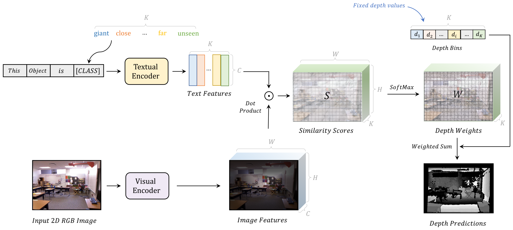

# DepthCLIP: Can Language Understand Depth?
Official implementation of the paper "Can Language Understand Depth?"

***Accepted by ACM Multimedia 2022 (Brave New Idea)***

Paper Link: https://arxiv.org/abs/2207.01077

PPT:   [DepthCLIP.pdf](DepthCLIP.pdf) 

Presentation Video (15min): https://files.atypon.com/acm/37a0a7fe422cdb908bab81f1b2a88743

**Authors:** Renrui Zhang\*, Ziyao Zeng\*, Ziyu Guo, Yafeng Li

### Overview



In this paper, we propose to apply CLIP for zero-shot monocular depth estimation, named DepthCLIP. We found that the patches of input image could respond to a certain semantic distance token and then be projected to a quantified bin to obtain the depth prediction. Without any training, our DepthCLIP surpasses existing unsupervised methods and even approaches the fully-supervised networks. 

To our best knowledge, we are the first to conduct zero-shot adaptation from the semantic language knowledge to quantified downstream tasks and perform zero-shot monocular depth estimation. We hope our work could cast a light on the research of bridging semantic vision language knowledge to quantitative tasks.


👆Visualization for monocular depth estimation of our DepthCLIP. Note that we require no training and directly transfer CLIP for zero-shot prediction.

### Poster


### Preparation

Please refer to [ASTransformer](https://github.com/WJ-Chang-42/ASTransformer) to set up environment and prepare NYU Depth V2 Dataset.

Place entire **"official_splits"** file under **`./datasets/NYU_Depth_V2/`**

### Test


Evaluate with our DepthCLIP:
``` 
sh tesh.sh
```

CLIP pre-trained model will be download automatically during testing (if no bug...)

### Only Want to Look Code

Please see **./monoclip.py** for our main model.

​		——our main contribution lies here, see class: MonoCLIP

Please see **./eval.py** for our main function.

​		——help to understand the pipeline

Please see **./calculate_error.py** for evaluation.

​		——similar to original ASTransformer, not change too much

Please see **./clip/model.py** to see our usage of CLIP.

​		——similar to original CLIP, not change too much

## Acknowledgement

Our code borrows a lot from:
- [CLIP](https://github.com/openai/CLIP)
- [ASTransformer](https://github.com/Strawberry-Eat-Mango/PCT_Pytorch)
